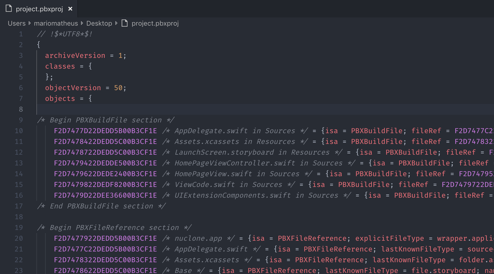
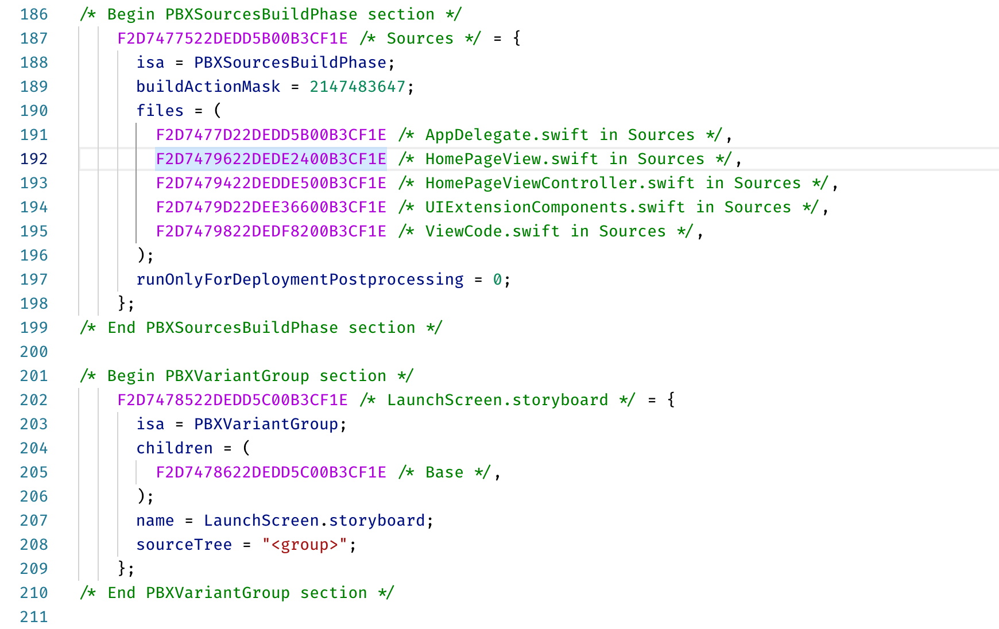

# Syntax project.pbxproj

This extension integrates the project.pbxproj into Visual Studio Code, allowing colorization and grammar knowledge.

## Features

Syntax project.pbxproj allow Visual Studio Code understand the .pbxproj grammar and can highlight file.

**Examples:**
   

 
> Tip: An aid at merge time
   

## Requirements

This extension no has requirements

## License

See more details in MIT [LICENSE.md](LICENSE)
